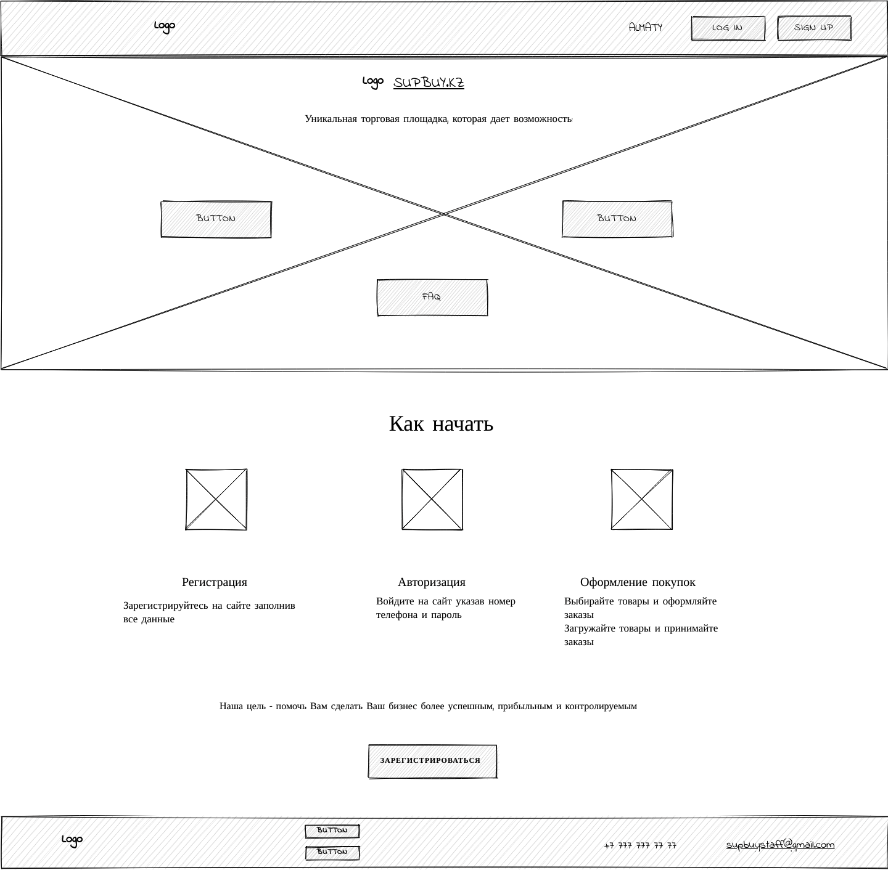
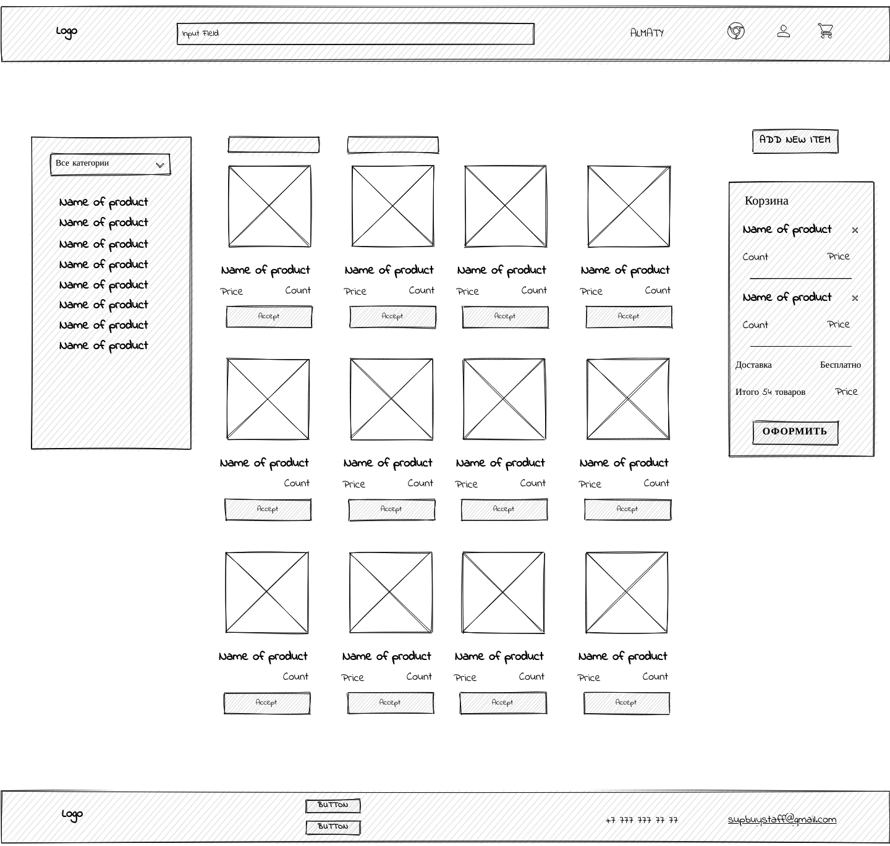

# CSS 489 Diploma preparation 
## Team members 
+ Anel Zharylkapova - Project Manager 
+ Alikhan Adilov - Business Analyst & Backend developer 
+ Dina Slambek - Frontend Developer 
+ Amirzhan Zhuvandykov -  System analyst & Backend Developer 
+ Aruzhan Satybaldy -  UX/UI designer 
+ Yelnur Madi -  UX/UI designer 
 
## Project 
- Online trading platform to optimize the procurement process and sales for buyers and suppliers 
 
 
## User Story 
 
User story 1:  
As a supplier user, I want to be able to upload my product to the platform with a photo of the product and the optimal price of the product. 
 
User story 2:  
As a buyer user, I want to be able to view the desired product,compare products with each other in order to select the appropriate product and add it to the cart. 
 
User story 3:  
As a buyer user who did not find the right product, want to be able to upload the right product with a photo of the product and an acceptable price of the product. 
 
User story 4:  
As a supplier user, I want to be able to view the products offered by buyers, compare prices and choose the appropriate option for buyers. 
 
User story 5:  
As a user, I want to be able to see the selected products in the cart. 
 
User story 6:  
As a user, I want to be able to make a purchase in the shopping cart. 
 
User story 7:  
As a supplier user, I want to be able to offer my services without losing time and money. 
 
User story 8:  
As a buyer user, I want to be able to find a product at a low price at a time convenient for me. 
 
 
 
 
## Sitemap 
 

 

 
## Wireframes (Prototype) 
 
 

